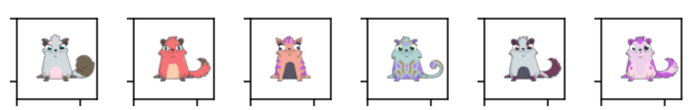
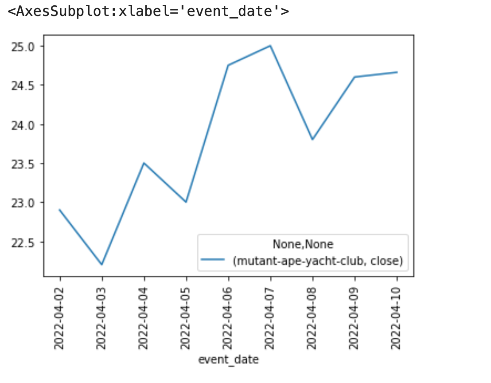
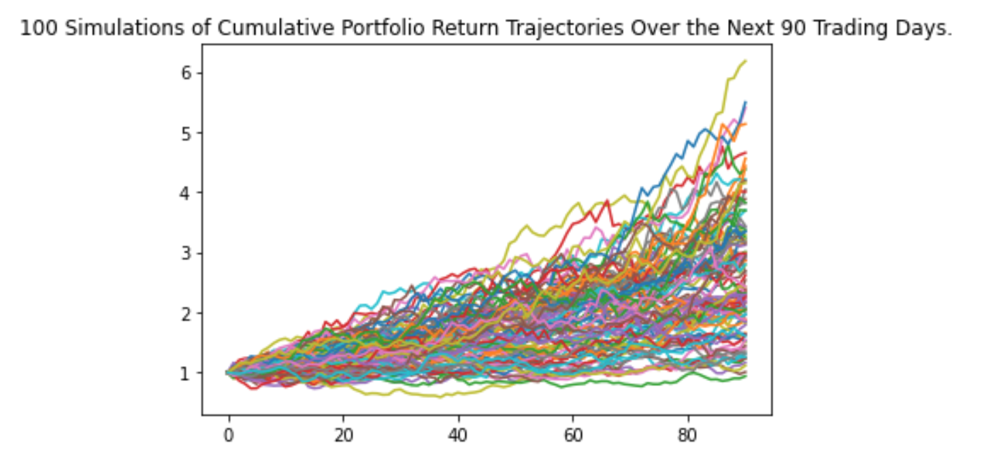

# NFT Price Tracker

## Background 
NFTs are digital assets that are unique and represents real-world tangible objects like art, music, in-game items, videos, audio recording and photos. They can be bought and sold online using crypotcurrency and are becoming increasingly popular. 
This project will create an NFT price tracker to compare and forecast NFT valuations to  provide recommendations for NFT investors, collectors and traders.  It will aggregate top NFT projects based on popularity and activity, and help new NFT investors decide which NFTs to purchase based on their risk tolerance. The following data will be considered;  daily prices, volume , life span of collection, rank and popularity, trends, and activity using OpenSea API (as available).

## Technology

* Required environments: pyvizenv and alphacha env
* OpenSea API
* Python 
* Jupyter Notebook 
* Streamlit

This can be done by activating the pyvizenv env and also loading the alpaca apis using below commands

1) pip install python-dotenv
2) pip install alpaca-trade-api (this one might not be needed as we are getting data from opensea API)

***This notebook needs pyvizenv env to display all the images in panel and alpacha env to load env variables**
## Resources 

Data for this project was retrieved from [OpenSea](https://opensea.io/), an API key was required and can be obtained here:
[Request OpenSea API]( https://docs.opensea.io/reference/request-an-api-key)

[OpenSea API Asset Data](https://api.opensea.io/api/v1/assets)

[OpenSea API Documentation](https://docs.opensea.io/reference/getting-assets)

[Alpaca API](https://api.alternative.me/v2/ticker/Ethereum/?convert=CAD)

To get different asserts that belong to different collection slug (e.g boredapeyachtclub, cryptokitties
pudgypenguins,doodles-official) below API was used
## Examples

A panel will display random 10 asset from a particular collection as below

To get event data for any given asset, below API was used
[Get Events](https://api.opensea.io/api/v1/events)

the documentation for this API is at the link - 
[Doc](https://docs.opensea.io/reference/retrieving-asset-events)

In addition, to get the current price of ETH, the alpacha API was used

[Alpaca API](https://api.alternative.me/v2/ticker/Ethereum/?convert=CAD)

***Once the successful sale event data is retreived, the floor price was determined**
We can get the closing price of a stock for a day using Alpacha APIs.
However, we do not have a closing price for an NFT, we get the different events for an NFT and the NFT
can have multiple sales per day.
We had 2 options to determine the price of an NFT per day
1) get average of price of the NFT sold for a day
2) get the floor price (min price) the NFT is sold on any particular day

We have proceeded with option 1 and the data is based on the min price of an NFT when there are multiple sales for an NFT for a particular day
In addition, we have calculated the data using the rolling median over a period of 5 days to avoid the high fluctuations in data

An NFT collection can have different assets and the prices of the assets vary based on the rarity/features.
For the sake of simplicity, we have treated all asset equally and the floor price is the lowest price of any of the asset sold on a particular day.

The floor price over a period of time is displayed as a line chart
***The price (y axis) is in ETH***

***Monte Carlo simulations***
Using the floor price data, the Monte Carlo simulations are generated for different NFT collections
Since the available data is less, the projection is for a shorter duration of time (say 90 days)

## References 
[UToronto BootCamp](https://utoronto.bootcampcontent.com/utoronto-bootcamp/UTOR-VIRT-FIN-PT-02-2022-U-LOL/-/blob/main/Units-Activities/05-APIs/Supplemental/AlpacaMarkets_Installation-Guide.md)
## Contributors

Chantal Garnett, Sameer Lakhe, Emiliano Mendez, Marcus Policicchio
